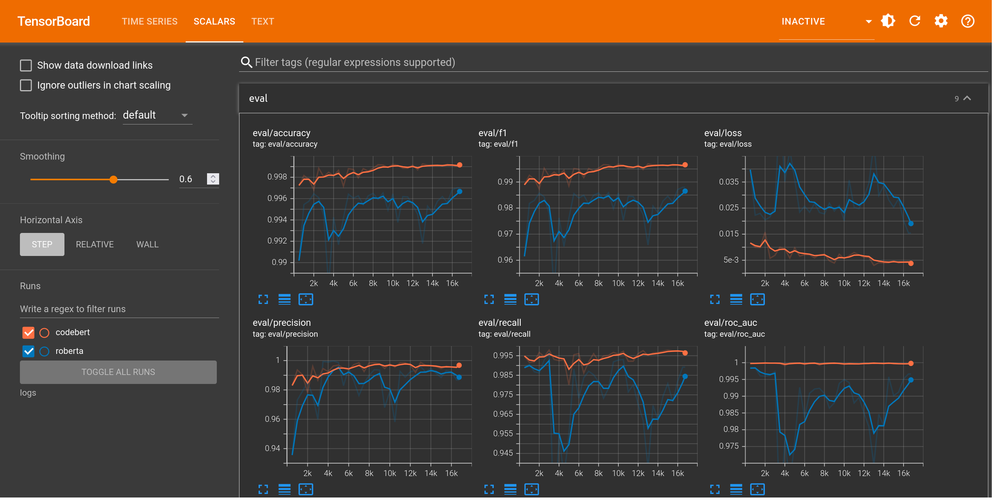
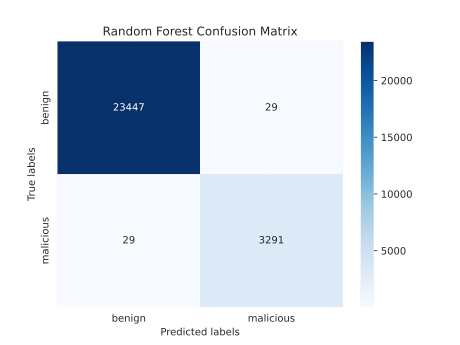
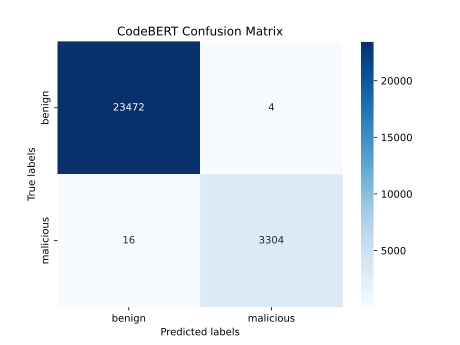

# Malicious Payload Detection with Machine Learning

This project aims to explore machine learning methods of distinguishing between benign and malicious web payloads, which could be used to enhance the capabilities of web application firewalls (WAFs) and intrusion detection systems (IDSs). It contains a comprehensive pipeline that involves data preprocessing, feature engineering, model selection, and hyperparameter tuning to detect malicious web payloads. Two models, namely a Random Forest model and a fine-tuned CodeBERT model, were trained and evaluated, exhibiting robust performance with F1-Scores of 0.9913 and 0.9970, respectively. The models’ performance was benchmarked and visualized, providing insights for their real-world applicability in web security contexts.



## 🛠️ Technologies & Libraries

- **Machine Learning**: Scikit-learn, HuggingFace Transformers
- **Data Processing**: Pandas, NumPy, NLTK
- **Data Visualization**: Matplotlib, Seaborn
- **Hyperparameter Tuning**: Optuna

## 🏗️ Project Structure

```plaintext
📁 configs                  # Configuration files for the pipeline
│   📄 roberta.json         # Configuration for fine-tuned RoBERTa pipeline
│   📄 codebert.json        # Configuration for fine-tuned CodeBERT pipeline
│   📄 rf.json              # Configuration for Random Forest pipeline
📁 data                     # Data storage
│   📄 dataset.csv          # Merged payload dataset
📁 models                   # Repository for trained model artifacts
│   📁 rf                   # Random Forest model artifacts
│   📁 roberta              # RoBERTa model artifacts
│   📁 codebert             # CodeBERT model artifacts
📁 notebooks                # Jupyter notebooks for EDA and experimentation
│   📓 eda.ipynb            # Exploratory data analysis notebook
│   📓 evaluate_bert.ipynb  # Evaluation of the RoBERTa model
│   📓 evaluate_rf.ipynb    # Evaluation of the Random Forest model
│   📓 hyperopt_rf.ipynb    # Hyperparameter tuning for Random Forest
│   📓 hyperopt_tfidf.ipynb # Hyperparameter tuning for TF-IDF
│   📓 merge.ipynb          # Merging of the public datasets
📁 src                      # Source code of the project
│   📄 pipeline.py          # Configurable end-to-end pipeline
│   📄 preprocess.py        # Data preprocessing and feature engineering 
│   📄 tfidf.py             # TF-IDF vectorization
│   📄 rf.py                # Random Forest model training and evaluation
│   📄 bert.py              # RoBERTa model fine-tuning and evaluation
📁 test                     # Test suite for the project
📄 Pipfile                  # Pipenv dependencies file
📄 Pipfile.lock             # Lock file ensuring deterministic builds
📄 README.md                # Project documentation and usage
📄 download.sh              # Script to download the datasets
```

## 🚦 Getting Started

Get up and running with the project:

- **Setup and Activate Virtual Environment**:

    ```bash
    pip install pipenv
    pipenv install --dev
    pipenv shell
    ```

- **Run Tests**:

    ```bash
    pytest
    ```

- **Execute a Pipeline**:

    ```bash
    python -m src.pipeline --config configs/rf.json
    ```

## 📊 Project Outline

### 1. Data Exploration

In-depth exploration of the dataset was carried out in the `eda.ipynb` notebook to identify key patterns and discrepancies in benign and malicious payloads. The following observations were made:

- Class Imbalance: A notable discrepancy in the representation of benign vs. malicious payloads, with malicious payloads accounting for only 12.39% of the dataset.
- Encoding / Obfuscation: A variety of encoding and obfuscation techniques were discovered, including URL and HTML encoding, and hex encoding.
- Payload Length: Malicious payloads tend to be longer than benign ones.
- Special Characters: Malicious payloads tend to contain more special characters than benign ones.
- Common Words: In benign payloads, words seem to relate more to web elements like `a`, `href`, `class`, `li`, and `title`. In malicious payloads, words like `alert`, `script`, and `xss` dominate, indicating common attack patterns in cross-site scripting (XSS).
- Feature Correlation: The `label` has a moderate positive correlation with `special_chars_count` indicating that the presence of more special characters could be a sign of malicious intent.

### 2. Data Preprocessing

- **Script Overview**:
  - A preprocessing script (`preprocess.py`) performs several actions on the dataset:
    - **NA Handling**: Omission of entries with missing values.
    - **Duplicate Handling**: Removal of duplicate payloads.
    - **URL and HTML Decoding**: Application of URL and HTML decoding to payloads.
    - **Text Normalization**: Conversion of payloads to lowercase.
    - **Feature Engineering**: Introduction of two new features:
      - `payload_len`: The length of the payload.
      - `special_chars_count`: The count of special characters.
    - **Train-Test Split**: 80/20 split while maintaining label distribution.
    - **Data Saving**: The preprocessed data is stored in Parquet format for optimized I/O operations.
    - **Statistical Summary**: Generation and storage of label and category count summaries.
  - For further exploration, statistical summaries are stored in JSON format, facilitating convenient subsequent analysis and record-keeping.

- **Feature Engineering**:
  - **TF-IDF Vectorization**: The payload text for the random forest model is tokenized using the NTLK tokenizer and vectorized using the TF-IDF vectorizer.
  - **RoBERTa Tokenization**: The payload text for the RoBERTa model is tokenized using the RoBERTa tokenizer, which is a subword tokenizer that can handle out-of-vocabulary words.

### 3. ML Model Selection

The selection of Random Forest and RoBERTa was informed by the understanding developed during data exploration and the inherent capabilities of the models.

- **Random Forest:**
  - **Insensitivity to Imbalanced Data:** Can handle the class imbalance observed in the data.
  - **Interpretability:** Offers insights into feature importances.
- **RoBERTa:**
  - **Sequential Understanding:** Can understand the sequential nature of payloads, which is important for understanding the structure of HTML and JavaScript.
  - **Transfer Learning:** Leverages pre-existing knowledge from pre-training, potentially providing robustness in understanding varied payload structures.

### 4. Hyperparameter Tuning

- _Process & Technique:_
  - **Random Forest:** Performed in `hyperopt_rf.ipynb` and `hyperopt_tfidf.ipynb` notebooks using Optuna and validated through cross-validation maximizing the F1-Score.
  - **RoBERTa:** Two pre-trained models were fine-tuned using the HuggingFace Transformers library. First, a original prtrained RoBERTa base model was fine-tuned on the dataset, and then a RoBERTa model pre-trained on the [CodeSearchNet](https://github.com/github/CodeSearchNet), called [CodeBERT](https://huggingface.co/microsoft/codebert-base), was fine-tuned on the dataset.
- _Improvements:_
  - The hyperparameter tuning process resulted in a slight improvement in the model's performance, as shown below
    - **Random Forest**:
      - Before: F1-Score of 0.9837
      - After: F1-Score of 0.9913
    - **RoBERTa**:
      - Original: F1-Score of 0.9880
      - CodeBERT: F1-Score of 0.9970
    - **Insight:**
      - CodeBERT significantly outperformed the original RoBERTa model, indicating that pre-training on code data can be beneficial for understanding web payloads.

### 5. Final Results

| Model          | F1-Score | Precision | Recall  | Inference Time |
|----------------|----------|-----------|---------|-----------------|
| Random Forest  | 0.9913   | 0.9913    | 0.9913  | ~25 ms (CPU)    |
| CodeBERT       | 0.9970   | 0.9988    | 0.9952  | ~10 ms (GPU)    |

- **🥈 Random Forest:**
  - **Real-World Applicability:** Given its high precision and recall, this model shows promise for real-world applications. However, its inference time is relatively high, which could be a concern in real-time threat detection.



- **🥇 CodeBERT:**
  - **Real-World Applicability:** With superior performance metrics and lower GPU-based inference time, the fine-tuned CodeBERT model presents itself as a well-suited option for real-time threat detection in web traffic, particularly when GPU resources are accessible.



### 🚀 Future Prospects

- **Inference Time Optimization:** Explore methods to speed up the model's inference, possibly through low-level optimizations using languages like Rust.
- **Enhanced Feature Engineering:** Investigate the impact of integrating hand-crafted features, such as special character counts, with the text data used in the transformer-based models. This could potentially uplift model performance.
- **Model architecture exploration:** Explore the impact of using different transformer architectures, such as BERT, XLNet, and GPT-2, on the model's performance.
- **Expand Dataset:** The dataset used in this project is relatively small and could be expanded to include more malicious payloads, potentially improving model performance.
